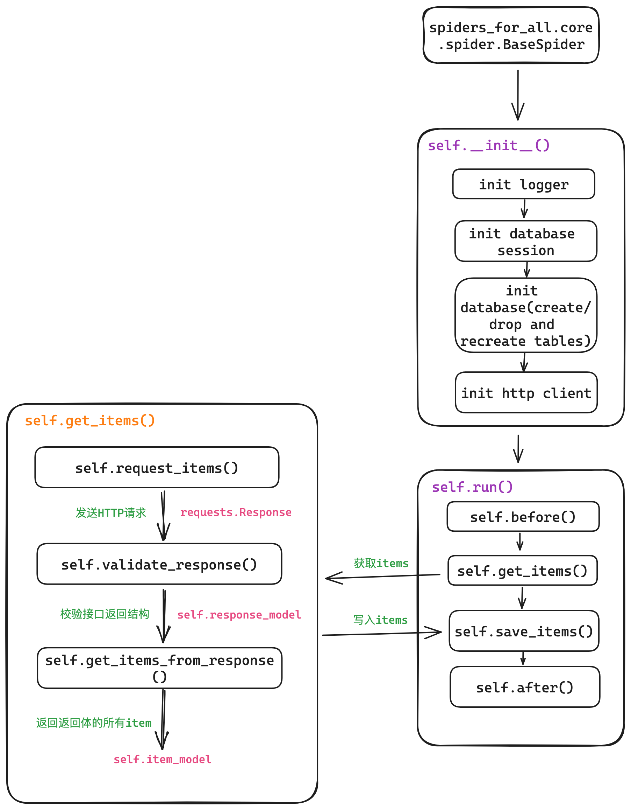

<p align="center">

</p>

> 爬取、下载哔哩哔哩、小红书等网站数据、视频, 持续更新中...

> **Warning:**
> 
> 本项目仅供学习交流使用, 请勿用于商业及非法用途, 由此引起的一切后果与作者无关


# Menu

- [Menu](#menu)
- [Quick Preview](#quick-preview)
- [Installation](#installation)
- [Documentation](#documentation)
- [Roadmap](#roadmap)
- [Customization](#customization)
- [Known Issues](#known-issues)

# Quick Preview 

**根据用户id爬取b站用户主页投稿视频**

```sh
python -m spiders_for_all bilibili download-by-author -m 用户id -s 保存目录
```

**根据note_id批量爬取小红书笔记内容**

```sh
python -m spiders_for_all xhs download-by-id -i note_id1,note_id2,note_id3 -s 保存目录
```

**更多用法见[Documentation](#documentation)部份**

# Installation

```sh
pip install spiders-for-all # python 版本 >= 3.12
```

# Documentation

**点击进入对应平台的使用文档**

- [哔哩哔哩](./spiders_for_all/spiders/bilibili/README.md)

- [小红书](./spiders_for_all/spiders/xhs/README.md)

# Roadmap

- bilibili
  - [x] 综合热门、入站必刷等栏目爬虫
  - [x] 根据bvid爬取/批量爬取视频
  - [x] 根据用户id爬取用户主页投稿视频
  - [ ] 爬取用户动态
- xhs
  - [x] 根据note_id爬取/批量爬取笔记
  - [x] 根据用户id爬取用户主页首页笔记
  - [ ] 爬取笔记评论
- [ ] GUI

# Customization

**如果你想自定义爬虫, 可以参考以下指引**

首先需要了解一下项目爬虫的基本结构, 参考下图:



- `spiders_for_all/spiders`目录下存放各个平台的爬虫, 每个爬虫都是一个类, 继承自`spiders_for_all.core.spider.BaseSpider`类, 并实现`BaseSpider`类的`get_items_from_response`方法
- 继承自`BaseSpider`的爬虫, 会按照以下流程爬取目标网站数据
  - `self.__init__`: 初始化爬虫
    - 初始化logger
    - 初始化数据库连接
    - 初始化数据库表, 这一步的行为取决于`cls.db_action_on_init`:
      - `spiders_for_all.core.spider.DbActionOnInit.CREATE_IF_NOT_EXISTS`: 如果表不存在则创建
      - `spiders_for_all.core.spider.DbActionOnInit.DROP_AND_CREATE`: 直接删除并创建表
    - 初始化client:
      - `client`是一个`spiders_for_all.core.client.HttpClient`对象, 封装了失败重试、日志、以及生成模拟请求头`user-agent`的功能
  - `self.run`: 运行爬虫
    - `self.before`: 运行爬虫前执行的代码, 默认会打印一条日志
    - `self.get_items`: 从目标网站获取数据
      - `self.request_items`: 向`self.api`发送请求, 获取返回。会调用`self.get_request_args`获取额外的请求参数比如`params`, `data`等等
      - `self.validate_response`: 验证返回体结构, 如果定义了`self.response_model`, 会调用`self.response_model`基于`pydantic`对返回体进行验证。**注意这里的验证是业务验证, 不是HTTP状态的验证, `self.client`会自动验证HTTP状态。** 如果没有定义`self.response_model`, 则不会进行验证，直接返回原始的`requests.Response`对象
      - `self.get_items_from_response`: 从验证成功的返回体中取出对应的items, 返回items的数据类型完全取决于`cls.item_model`, 具体可以参考几个爬虫的实现
      - **需要注意的是, `self.request_items()`, `self.validate_response`, `self.get_items_from_response`均被封装在一个`retry`的wrapper内，这也就意味着如果出现: `HTTP状态码非200`, `业务返回体异常, 比如哔哩哔哩的-352业务码`, `获取items失败，比如网页没有返回正常的数据`这些情况, 均会触发自动重试**
    - `self.save_items`: 将爬取的数据保存到数据库
    - `self.after`: 运行爬虫后执行的代码, 默认会打印一条日志

- 除此之外, 需要额外定义一些类属性, 示例如下
  
  ```python
  import typing as t
  import logging
  import requests
  from sqlalchemy import orm
  from pydantic import BaseModel
  from spiders_for_all.core.response import Response
  from spiders_for_all.core.spider import BaseSpider, DbActionOnInit, DbActionOnSave
  from spiders_for_all.database.session import SessionManager
  from spiders_for_all.utils.logger import default_logger

  class MySpider(BaseSpider):
      api: str  # 目标API, 必须
      name: str # 爬虫名称, 必须
      alias: str # 爬虫别名, 必须
      platform: str # 爬虫所属平台, 必须
      description: str = "" # 爬虫描述, 可选

      database_model: t.Type[orm.DeclarativeBase] # 数据库表模型, 必须
      item_model: t.Type[BaseModel] # 爬取的数据模型, 必须
      response_model: t.Type[Response] | None = None # 返回体模型, 可选

      logger: logging.Logger = default_logger # 日志对象, 可选
      session_manager: SessionManager # 数据库连接管理器, 必须

      insert_batch_size: int = 100 # 批量插入数据库时的批量大小, 可选

      db_action_on_init: DbActionOnInit = DbActionOnInit.CREATE_IF_NOT_EXIST # 初始化数据库表时的行为, 可选
      db_action_on_save: DbActionOnSave = DbActionOnSave.DELETE_AND_CREATE # 保存数据时的行为, 可选

      def get_items_from_response(self, response: requests.Response | Response) -> t.Iterable[BaseModel]:
          # 从返回体中取出items, 必须
          pass
  ```

# Known Issues

- [ ] 小红书爬取用户投稿的笔记时, 由于小红书签名算法的问题尚未解决, 只能爬取用户投稿的首页数据, 需要下拉加载的数据暂时无法爬取(**由于xhs接口的解密成本较高, 该功能暂时不会考虑添加到本仓库中,有这个需求的用户可以参考一下其他作者的实现,再通过`client.update`的方式修改headers和cookies来进行调用**)
- [x] 低版本的sqlite可能不支持`ON CONFLICT DO UPDATE`语法, 如果遇到该问题请尝试升级sqlite版本 
- [x] 大批量下载视频时可能偶现下载中断导致失败的情况, 这种情况请在所有任务下载完成后, 运行`grep ERROR logs/bilibili.log`可以查看有哪些视频下载失败, 然后收集bvid重新下载即可。未来会考虑处理这种情况